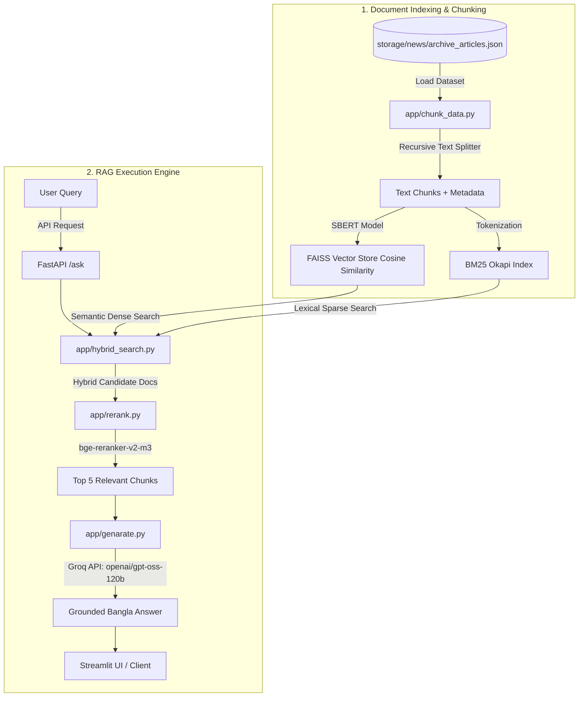

## Demo & Interface


*The Streamlit interface provides real-time query responses in Bengali alongside grounded source citations, publisher metadata, and article URLs.*

---

# Pure RAGNewsEngine: Bengali News RAG Architecture

[](https://www.python.org/)
[](https://fastapi.tiangolo.com/)
[](https://streamlit.io/)
[](https://github.com/facebookresearch/faiss)
[](https://www.langchain.com/)
[](https://groq.com/)
[](https://www.docker.com/)

A Bengali News Retrieval-Augmented Generation (RAG) engine. It combines hybrid retrieval (FAISS cosine similarity + BM25 lexical keyword search), neural cross-encoder passage reranking (`bge-reranker-v2-m3`), and context-grounded Bangla answer generation using Groq (`openai/gpt-oss-120b`).

This repository is a project build for experimentation and demos.

---

## Key Features

- **Hybrid Dual Retrieval (`app/hybrid_search.py`)**:
  - **Dense Semantic Search**: FAISS Vector Store powered by `bengali-sentence-similarity-sbert` using Inner Product / Cosine similarity (Weighted: 0.65).
  - **Sparse Lexical Search**: BM25 Okapi scoring for exact keyword and named-entity matching on Bangla text (Weighted: 0.25).

- **Cross-Encoder Reranking (`app/rerank.py`)**:
  - Passage reranking using `bge-reranker-v2-m3`.
  - Dynamic relevance thresholding (`>= 0.70`) and document-level deduplication to return only the top `k=5` candidate passages.

- **Context-Grounded Answer Generation (`app/genarate.py`)**:
  - High-speed inference using Groq API with `openai/gpt-oss-120b`.
  - Strict system prompt enforcing responses in Bangla based exclusively on retrieved context without outside hallucinations.

- **Async FastAPI Backend (`app/api.py`)**:
  - Lifespan model loading (pre-loading SBERT embedding, cross-encoder reranker, and FAISS vector index on startup).
  - Robust exception handling (`422` validation, `400` value errors, `503` service unavailable, `500` server errors).

- **Modern Streamlit UI (`streamlit_app.py`)**:
  - Customized card-based metadata interface displaying article author, publication date, source site, and article URL.

- **Full Docker & Compose Support (`Dockerfile`, `docker-compose.yml`)**:
  - Fully containerized local environment featuring multi-service orchestration, startup healthcheck grace periods, and volume persistence.

---

## Technical Stack & Architectural Rationale (What & Why)

This project is built using a modern hybrid RAG pipeline. Below is a detailed breakdown of the core components, algorithms, models, and tools used in this repository along with the reason each one exists.

### 1. Cosine Similarity & FAISS Vector Index (`MAX_INNER_PRODUCT`)
- **What is used**: FAISS (Facebook AI Similarity Search) configured with `DistanceStrategy.MAX_INNER_PRODUCT` on normalized embedding vectors, performing **Cosine Similarity** (`cos(theta) = A dot B / (||A|| ||B||)`).
- **Why it was used**:
  - Standard Euclidean distance measures magnitude distance, whereas Cosine Similarity measures directional similarity between high-dimensional vector embeddings.
  - In NLP semantic search, document length variations can distort vector magnitudes. Cosine Similarity ensures that query vectors and document chunk vectors are compared primarily on semantic alignment and contextual similarity.
  - Using FAISS inner product on normalized vectors provides fast retrieval over dense text vectors.

### 2. Sentence-BERT Bengali Embedding (`bengali-sentence-similarity-sbert`)
- **What is used**: `sentence-transformers` SBERT model pre-trained for Bengali similarity.
- **Why it was used**: Generates dense vector embeddings that capture Bengali semantics, synonyms, and grammatical context. It improves semantic retrieval when the user's question uses different Bengali vocabulary than the article.

### 3. BM25 Lexical Keyword Search (`rank-bm25`)
- **What is used**: BM25 Okapi probabilistic term-matching algorithm.
- **Why it was used**:
  - Dense vector search excels at semantic concepts but can miss precise named entities, numbers, proper nouns, location names, or exact dates.
  - BM25 provides high-precision keyword lookup by scoring token overlap across the archived news chunks.

### 4. Hybrid Dual Retrieval Fusion (`app/hybrid_search.py`)
- **What is used**: Weighted linear fusion combining FAISS cosine similarity (weight: `0.65`) and BM25 lexical score (weight: `0.25`).
- **Why it was used**:
  - Pure semantic search misses rare named entities, while pure lexical search misses context and synonyms.
  - Hybrid search merges the strengths of both approaches and creates a stronger candidate list before reranking.

### 5. Cross-Encoder Reranking (`bge-reranker-v2-m3`)
- **What is used**: FlagEmbedding `bge-reranker-v2-m3` cross-encoder model with relevance thresholding (`>= 0.70`).
- **Why it was used**:
  - Bi-encoders process query and document vectors independently to enable fast FAISS search.
  - A cross-encoder processes `[Query + Document]` jointly through transformer attention, giving better relevance scoring.
  - Passing candidates through a cross-encoder filters out noisy chunks, ensuring only the most relevant passages reach the LLM.

### 6. Document-Level Deduplication
- **What is used**: Custom deduplication logic selecting the single highest-scoring chunk per `doc_id`.
- **Why it was used**: Prevents multiple redundant chunks from the same news article from crowding out other relevant articles in the context window.

### 7. Context-Grounded Answer Generation (`openai/gpt-oss-120b` via Groq)
- **What is used**: Groq API hosting the `openai/gpt-oss-120b` model with strict Bangla prompt rules.
- **Why it was used**:
  - Groq provides low-latency inference for the final answer generation step.
  - The system prompt forces the model to generate answers in Bangla using only the provided retrieved news snippets, reducing hallucinations.

### 8. LangChain Orchestration Framework (`langchain-core`, `langchain-community`, `langchain-groq`, `langchain-huggingface`, `langchain-text-splitters`)
- **What is used**: Modular LangChain abstractions:
  - `RecursiveCharacterTextSplitter` for document chunking with overlap.
  - `HuggingFaceEmbeddings` and `FAISS` vector store wrappers for embedding and index management.
  - `ChatGroq` LLM wrapper for interaction with Groq models.
  - `Document` objects for metadata propagation across the pipeline.
- **Why it was used**:
  - Standardizes the RAG workflow by gluing together text splitters, vector indices, embeddings, prompt templates, and LLM clients.
  - Reduces custom boilerplate code for metadata handling and model initialization.

### 9. PyTorch Tensor & Hardware Engine (`torch`)
- **What is used**: PyTorch deep learning framework backend.
- **Why it was used**: Powers local tensor computations for SBERT embeddings and reranking. It enables GPU acceleration when available, with automatic CPU fallback.

### 10. Pydantic Data Validation & FastAPI Middleware (`pydantic`)
- **What is used**: Pydantic data models (`QueryRequest`) and custom FastAPI validation handlers.
- **Why it was used**: Enforces request body schema validation and returns clean JSON errors for malformed or empty payloads.

### 11. NumPy Numerical Computing (`numpy`)
- **What is used**: Vectorized mathematical operations in `app/hybrid_search.py`.
- **Why it was used**: Used for log-transform normalization of raw BM25 scores so lexical scores can be compared more cleanly with dense vector similarity scores.

### 12. Pillow Image Processing Engine (`Pillow`)
- **What is used**: PIL (`PIL.Image`, `PIL.ImageFile`) in `streamlit_app.py`.
- **Why it was used**: Robustly handles image loading and thumbnail rendering for source screenshot display.

### 13. Async FastAPI Server & Streamlit UI Framework
- **What is used**: FastAPI for asynchronous REST backend endpoints (`/ask`, `/`) and Streamlit for the interactive query dashboard UI.
- **Why it was used**:
  - **Decoupled Architecture**: Separates the retrieval/generation pipeline from presentation.
  - **Lifespan Initialization**: FastAPI pre-loads heavy models and FAISS indices into memory at server startup.
  - **User Experience**: Streamlit provides a responsive UI for displaying grounded Bangla answers and source cards.

---

## System Architecture



---

## Repository Structure

```text
RAGNewsEngine/
|-- app/                        # RAG Core Engine & Backend API
|   |-- api.py                  # FastAPI server & route handlers (/ask, /)
|   |-- chunk_data.py           # Dataset loader & document chunking logic
|   |-- config.py               # Path definitions & global configurations
|   |-- embedding.py            # SentenceTransformer embedding loader
|   |-- genarate.py             # Groq LLM integration & prompt template
|   |-- hybrid_search.py        # FAISS + BM25 hybrid search implementation
|   |-- logger.py               # Structured logging utility
|   |-- pipeline.py             # Execution pipeline orchestrator
|   |-- rerank.py               # Cross-encoder reranker & deduplication
|   `-- vector_store.py         # FAISS index creation, load, & persistence
|-- models/                     # Local model weights
|   |-- bengali-sentence-similarity-sbert/
|   `-- bge-reranker-v2-m3/
|-- storage/                    # News datasets and screenshots
|   `-- news/
|       `-- archive_articles.json
|-- vector_store/               # FAISS index artifacts
|   |-- index.faiss
|   |-- index.pkl
|   `-- metadata.json
|-- .dockerignore
|-- .env                        # Environment variable secrets
|-- Dockerfile                  # Container build instructions
|-- Dockerfile.frontend         # Streamlit container build instructions
|-- docker-compose.yml          # Service orchestration configuration
|-- demo.gif                    # Interface demo GIF
|-- requirements.txt            # Python dependencies
|-- requirements.frontend.txt   # Streamlit dependencies
`-- streamlit_app.py            # Interactive Streamlit frontend UI
```

---

## Prerequisites & Environment Setup

### 1. Requirements
- Python 3.10+
- `pip` package manager
- Groq API key
- Local model artifacts:
  - Embeddings: `models/bengali-sentence-similarity-sbert`
  - Reranker: `models/bge-reranker-v2-m3`

---

## Quick Start Guide

### Step 1: Clone & Setup Virtual Environment

```powershell
# Clone the repository
git clone <your-repo-url>
cd RAGNewsEngine

# Create virtual environment
python -m venv .venv

# Activate virtual environment (Windows PowerShell)
.\.venv\Scripts\Activate.ps1
# On Linux/macOS: source .venv/bin/activate
```

### Step 2: Install Dependencies

```powershell
# Install Python packages
pip install -r requirements.txt
```

### Step 3: Configure Environment Variables

Create a `.env` file in the root directory:

```env
GROQ_API_KEY=your_groq_api_key_here
```

---

## Running the Application

### 1. Start the FastAPI Backend

Run the API server on `http://127.0.0.1:8000`:

```powershell
uvicorn app.api:app --reload
```

### 2. Launch the Streamlit Frontend UI

In a new terminal window (with virtual environment activated):

```powershell
streamlit run streamlit_app.py
```

Open your browser at `http://localhost:8501`.

---

## Running with Docker & Docker Compose

You can containerize and run the entire application (FastAPI backend + Streamlit frontend) using Docker Compose:

### 1. Build and Start Services

```bash
docker compose up --build -d
```
*(Or `docker-compose up --build -d` on legacy setups)*

### 2. Check Service Health & Logs

```bash
docker compose ps
docker compose logs -f backend
```

- Backend: `http://localhost:8000` (Healthcheck: `http://localhost:8000/`)
- Streamlit Frontend: `http://localhost:8501`

### 3. Stop Containers

```bash
docker compose down
```

---

## API Reference

### Health Check

```http
GET /
```

**Response (`200 OK`):**
```json
{
  "status": "running"
}
```

---

### Ask Question (`/ask`)

```http
POST /ask
Content-Type: application/json
```

**Request Payload:**
```json
{
  "query": "Bangladesher bartaman orthoniti kemon?"
}
```

**Response Payload (`200 OK`):**
```json
{
  "answer": "....",
  "source": [
    {
      "title": "Example headline",
      "source": "prothomalo",
      "url": "https://example.com/article/123",
      "author": "Staff reporter",
      "publish_date": "2026-04-10T17:28:58+06:00"
    }
  ]
}
```

---

## Pipeline Detail & Configuration

| Module | Location | Details |
| :--- | :--- | :--- |
| Data Storage | `storage/news/archive_articles.json` | News dataset storing raw articles and metadata. |
| Vector DB | `vector_store/` | FAISS index using `DistanceStrategy.MAX_INNER_PRODUCT`. |
| LLM Model | `openai/gpt-oss-120b` | Configured via `langchain-groq` with 30s timeout and retry limit. |
| Hybrid Search Weights | `app/hybrid_search.py` | Semantic score weight: `0.65`, BM25 lexical weight: `0.25`. |
| Reranker Threshold | `app/rerank.py` | Cross-encoder minimum score threshold: `0.70`. |

---

## Troubleshooting & Notes

- **Missing Model Files**: Ensure local weights for SBERT and BGE Reranker exist inside the `models/` directory before running `api.py`.
- **Groq API Rate Limits**: If queries fail with API errors, check your key quota at [Groq Developer Console](https://console.groq.com/docs/quickstart).
- **Backend Model Load Time**: On initial boot in Docker, model initialization may take 15-30 seconds; the Docker Compose setup includes a 60s startup grace period health check.

---

## License & Attribution

Developed for experimentation and research in Bengali Natural Language Processing (NLP) and RAG architectures.
